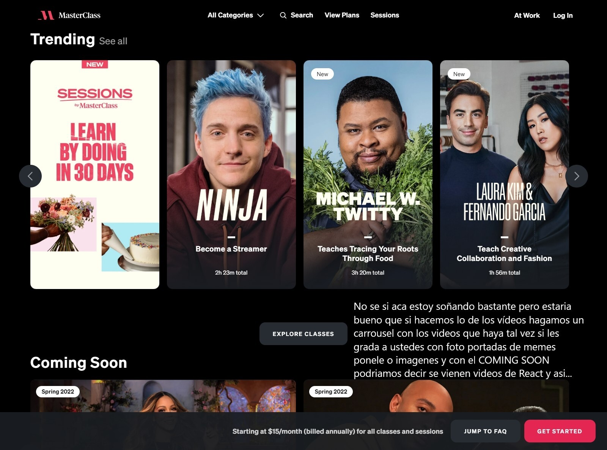

# ReadMe1 del Grupo 1- proyecto 'E-ARBI'

En este ReadMe se documentan todas las ideas esteticas que tuvimos las miembros del grupo para poder lograr E-ARBI. 

* Ideas basandonos en las páginas elegidas
* Decisiones esteticas generales
 

## Ideas basandonos en las páginas elegidas
* Camila Aguirre
* Victoria Gonzalez
* Carolina Beer
* Luana Acosta

## Camila Aguirre
Página analizada: 
https://www.masterclass.com/?sscid=41k6_dipma&utm_source=shareasale&utm_medium=affiliate&utm_campaign=pp_|_brd_|_all_|_314743&utm_term=Aq-Prospecting

## Victoria Gonzalez
Página analizada:
https://www.coderhouse.com/?utm_term=coderhouse&gclid=CjwKCAjw6dmSBhBkEiwA_W-EoM3ogLshEsO-3Di2TnnVZwb0j3aQq9T3AheiEqnDPbbJAr1WKzjVUBoCJ58QAvD_BwE
 
1.Botón de wpp.
 
Habíamos hablado que solo nos gusta con el logo

 
2. Botón directo para ir a ver todos los cursos
 

 
3. poner imágenes de los profesores tipo “Gabriel Muñoz- HTML, JAVASCRIPT.” “Talia Rodriguez CSS” Con la fotito porque genera confianza.
 

 
4.Podríamos poner experiencias, pedirle a nuestros compañeros que hagan una publicación en linkedin sobre DevJump para que podamos poner con experiencias reales.
 

 
5.Agregar preguntas frecuentes en un desplegable
 

 

## Carolina Beer
Página analizada:
https://www.pluralsight.com/
 

 

 

 

 

## Luana Acosta
Página analizada:
https://www.skillshare.com/
 

 
No me gusta el header poco interactivo, ni que la imagen salga del margen.
Me gusta la paleta de colores, pero no el cambio de blanco y negro/azul.
Me agrada la opción de que se pueda registrar con google, facebook, etc, para agilizar más el proceso de registro; así incrementa las ganas de iniciar el curso del usuario, los requisitos se ingresarán después. 
 

 
No se debería implementar eso de que abra en otra pestaña un url de la misma página porque dificulta la navegación del usuario.
 

 
Me encanta la idea de hacer un apartado con los trabajos de los que tomaron cursos en la plataforma, así muestra el progreso del curso. Lo que no me gusta es que se recarguen solos cuando se va para abajo, tendría que estar la opción de "Ver más".
 

 
También me agrada la idea de que el registro sea una caja que aparece en la misma pantalla y fadea la página en la que estaba.
 

Está interesante la idea de filtrar cursos por popularidad, tal vez para eso al finalizar todo uno se le tendría que dar unas estrellitas para calificar el curso y así poder mostrar cuales son los más populares.
 

 
Bueno, al abrir un curso ahí vi que se puede dejar una reseña y también calificar con corazoncitos.
 

 
Al final de cada pantalla principal de introducción de un curso se puede agregar esta opción de cursos relacionados para así seguir manteniendo al usuario, por ejemplo termina un curso de html y que le aparezca uno de css, o que termine uno de css y aparezca uno de dibujos con css, etc.
 

 
Lista de módulos del curso con su respectivo video y material teórico y que se vaya "desbloqueando" cada módulo a medida que avanza, también marqué que está buena esa idea que el video se haga miniatura y se ponga a un costado automáticamente cuando scrollea fuera del cuadro en el que está el video.

## Ideas basandonos en las páginas elegidas
* Nombre de la página
* Logo de la página
* Paleta de colores
* Font elegida
 

## Nombre de la página
 E-ARBI.
¿Por qué la elección del nombre? El nombre es una fusión de E-learning y Arbi
 

## Logo de la página
 

 
Son las siglas del nombre de la plataforma y una molécula que tiene que ver con la ciencia.
 

## Paleta de colores
 

 
Paleta de colores elegida basándonos en los colores de Arbusta y también los de Arbi.
 

## Font elegida
 
Elegimos anonymous pro font ya que es clara, legible y se acopla al estilo del tópico de la página. 
 
Ejemplo de anonymous pro font:
 

